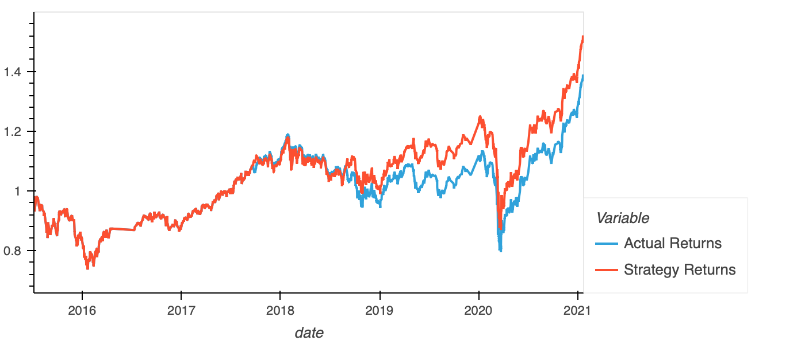
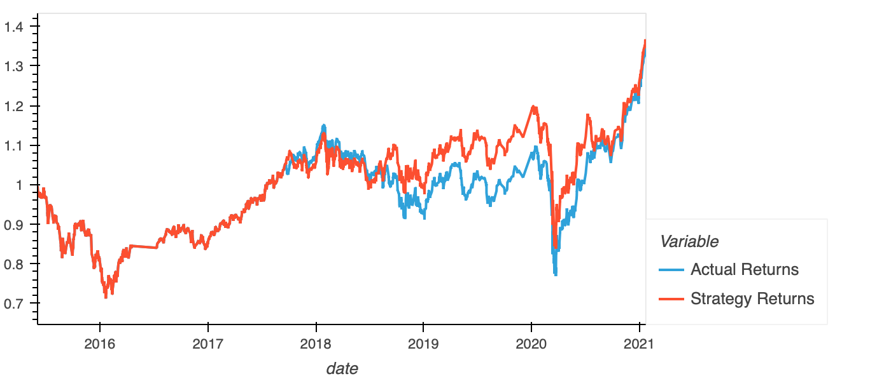
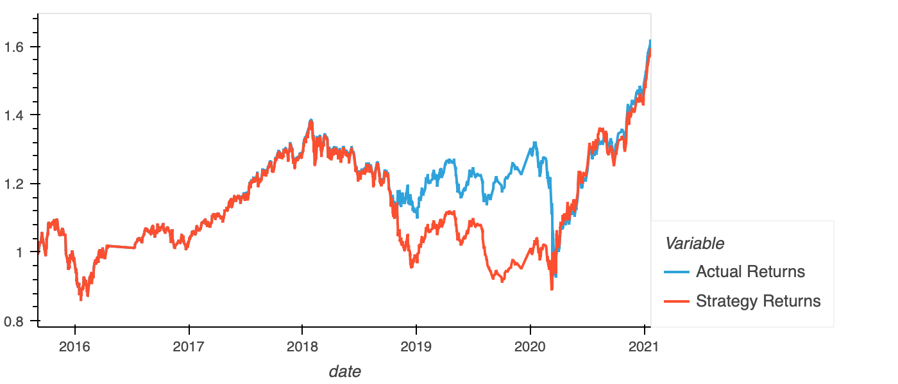
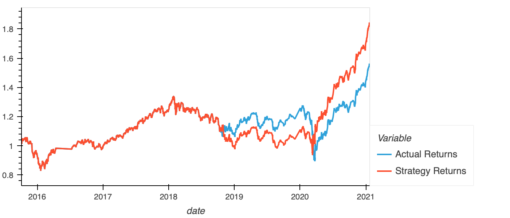
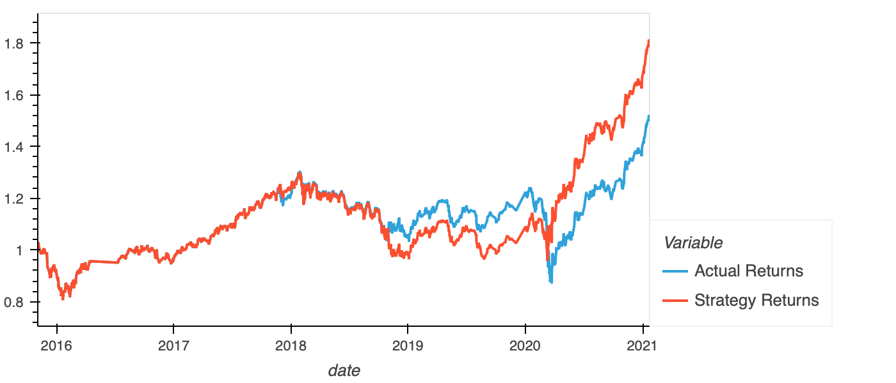
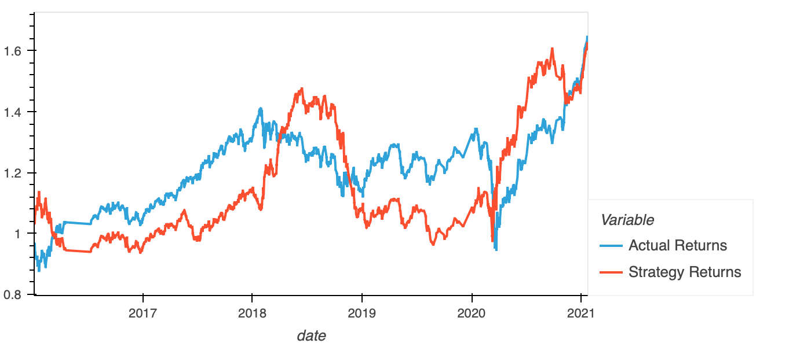
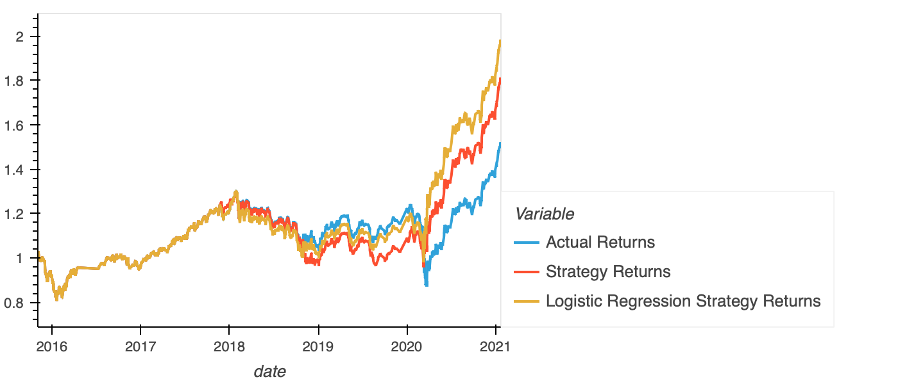

# Training window variation

## Initial prediction for 3-months training window

|              | precision | recall | f1-score | support |   |
|--------------|-----------|--------|----------|---------|---|
| -1.0         | 0.43      | 0.04   | 0.07     | 1804    |   |
| 1.0          | 0.56      | 0.96   | 0.71     | 2288    |   |
| accuracy     |           |        | 0.55     | 4092    |   |
| macro avg    | 0.49      | 0.50   | 0.39     | 4092    |   |
| weighted avg | 0.50      | 0.55   | 0.43     | 4092    |   |

## Prediction for 2-months training window

|              | precision | recall | f1-score | support |   |
|--------------|-----------|--------|----------|---------|---|
| -1.0         | 0.39      | 0.04   | 0.06     | 1825    |   |
| 1.0          | 0.56      | 0.96   | 0.70     | 2318    |   |
| accuracy     |           |        | 0.55     | 4143    |   |
| macro avg    | 0.47      | 0.50   | 0.38     | 4143    |   |
| weighted avg | 0.48      | 0.55   | 0.42     | 4143    |   |

## Prediction for 5-months training window

|              | precision | recall | f1-score | support |   |
|--------------|-----------|--------|----------|---------|---|
| -1.0         | 0.45      | 0.05   | 0.08     | 1745    |   |
| 1.0          | 0.56      | 0.96   | 0.71     | 2232    |   |
| accuracy     |           |        | 0.56     | 3977    |   |
| macro avg    | 0.51      | 0.50   | 0.40     | 3977    |   |
| weighted avg | 0.51      | 0.56   | 0.43     | 3977    |   |

## Prediction for 6-months training window

|              | precision | recall | f1-score | support |   |
|--------------|-----------|--------|----------|---------|---|
| -1.0         | 0.44      | 0.02   | 0.04     | 1732    |   |
| 1.0          | 0.56      | 0.98   | 0.71     | 2211    |   |
| accuracy     |           |        | 0.56     | 3943    |   |
| macro avg    | 0.50      | 0.50   | 0.38     | 3943    |   |
| weighted avg | 0.51      | 0.56   | 0.42     | 3943    |   |

## Prediction for 7-months training window

|              | precision | recall | f1-score | support |   |
|--------------|-----------|--------|----------|---------|---|
| -1.0         | 0.45      | 0.05   | 0.09     | 1707    |   |
| 1.0          | 0.56      | 0.95   | 0.71     | 2175    |   |
| accuracy     |           |        | 0.56     | 3882    |   |
| macro avg    | 0.51      | 0.50   | 0.40     | 3882    |   |
| weighted avg | 0.51      | 0.56   | 0.44     | 3882    |   |

## Prediction for 9-months training window

|              | precision | recall | f1-score | support |   |
|--------------|-----------|--------|----------|---------|---|
| -1.0         | 0.45      | 0.31   | 0.37     | 1616    |   |
| 1.0          | 0.57      | 0.70   | 0.63     | 2088    |   |
| accuracy     |           |        | 0.53     | 3704    |   |
| macro avg    | 0.51      | 0.51   | 0.50     | 3704    |   |
| weighted avg | 0.52      | 0.53   | 0.51     | 3704    |   |

My conclusion is that F1-score are the best for 7-months training window.

# Short-Long average window variation

I chacked all possible combinations for the following parameters Short=(4,12,26) and Long=(50,100,200) for training-window size = 7 months. I found that Short=4, Long=100 give the best caccuracy and F1-scores. Also I found that increase of the long window increases F1-score for (-1.0) states, but reduces F1-score for (1.0) state. 

# SGD classifier

Original model classificatoin report

|              | precision | recall | f1-score | support |   |
|--------------|-----------|--------|----------|---------|---|
| -1.0         | 0.45      | 0.05   | 0.09     | 1707    |   |
| 1.0          | 0.56      | 0.95   | 0.71     | 2175    |   |
| accuracy     |           |        | 0.56     | 3882    |   |
| macro avg    | 0.51      | 0.50   | 0.40     | 3882    |   |
| weighted avg | 0.51      | 0.56   | 0.44     | 3882    |   |

Logistic Regression classification report

|              | precision | recall | f1-score | support |   |
|--------------|-----------|--------|----------|---------|---|
| -1.0         | 0.58      | 0.02   | 0.05     | 1707    |   |
| 1.0          | 0.56      | 0.99   | 0.72     | 2175    |   |
| accuracy     |           |        | 0.56     | 3882    |   |
| macro avg    | 0.57      | 0.51   | 0.38     | 3882    |   |
| weighted avg | 0.57      | 0.56   | 0.42     | 3882    |   |

Despite the fact that overall accuracy of the Logistic Regression classifier is similarto the original model, but we see some improvement for the 1.0 F1-score, therefore we can see better performance while market is growing 

